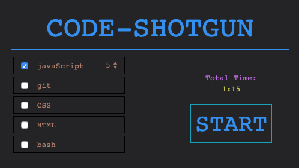
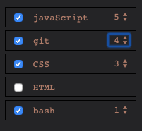
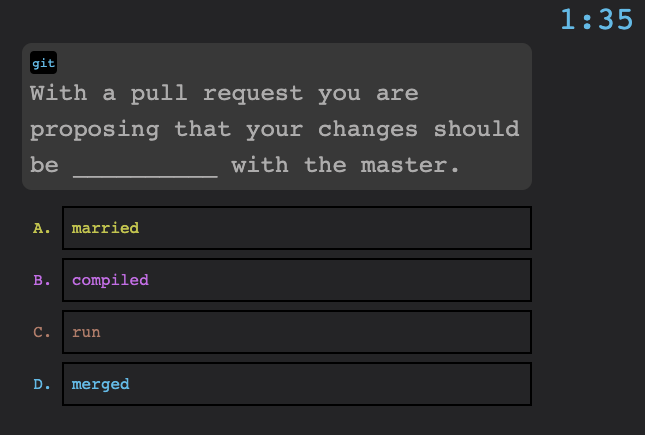
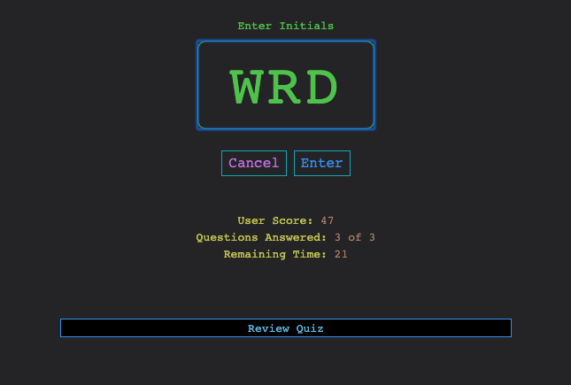

# code-shotgun

## Description 

Timed quiz on full-stack progamming and mark-up languages to test your coding knowledge. Code-shotgun records your initials and score so you can compare your skills to your friends, family, and colleagues.  The program was designed 
to be flexible to easily add more questions and languages as needed for intensive full-stack training or review.

## Usage 

Select your choice of coding and markup languages. Once selected, a select box will appear and you can adjust the number questions to be included of that language.  Each question adds 15 seconds to the total time of the quiz. 

        
Press START and the quiz begins. Timer begins and is displayed in upper right corner.  Questions are diplayed with reference to it's language and the multiple choice answers. Click your choice of answer and you will be greeted with and audio sound and a temporary display to indicate whether question was answered correctly.  Incorrect answers subtract 15 seconds from the time remaining.  Zero time remaing results in a score of zero. Score is derived from time remaining divided the total quiz time.

After quiz you are prompted to enter your initials for storage so you can compare scores with others.  Toggle "Review Quiz" to see questions and your answers.

Once scores have been recorded you can review them by clicking link on start page.

## Credits

[Bootstrap](https://getbootstrap.com/)

"Correct" [Audio Clip](https://freesound.org/people/JapanYoshiTheGamer/sounds/361263/)

"Incorrect" [Audio Clip](https://freesound.org/people/SamsterBirdies/sounds/363920/)

